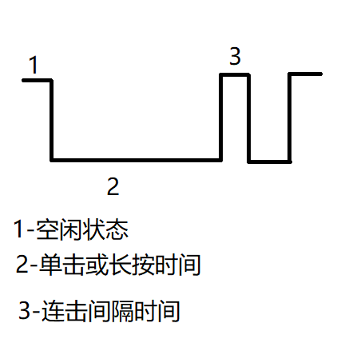

# tl_button 介绍

> 说明：你需要在这里对 tl_button 软件进行简单的介绍，描述背景、功能特点等等……

## 软件架构

> 简单介绍

### 软件架构图

如上 tl_button 软件架构图所示, 共分为 x 层，……，每一层描述。

## tl_button 功能特点

### 功能一

tl_button 的功能一。

- 功能
- 功能
- 功能

### 功能二

功能二

### 功能三

功能三
